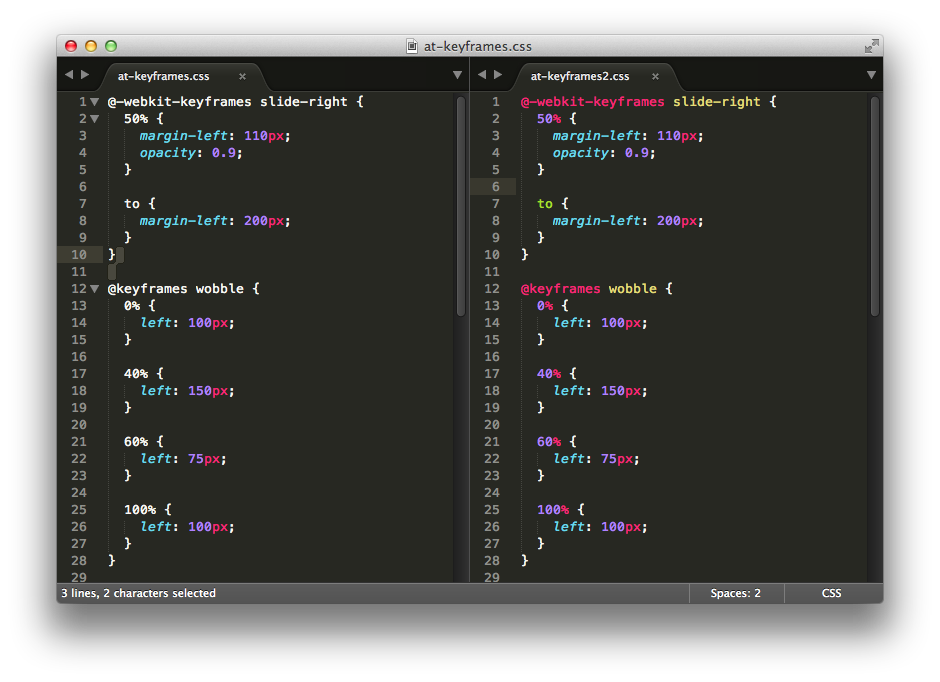
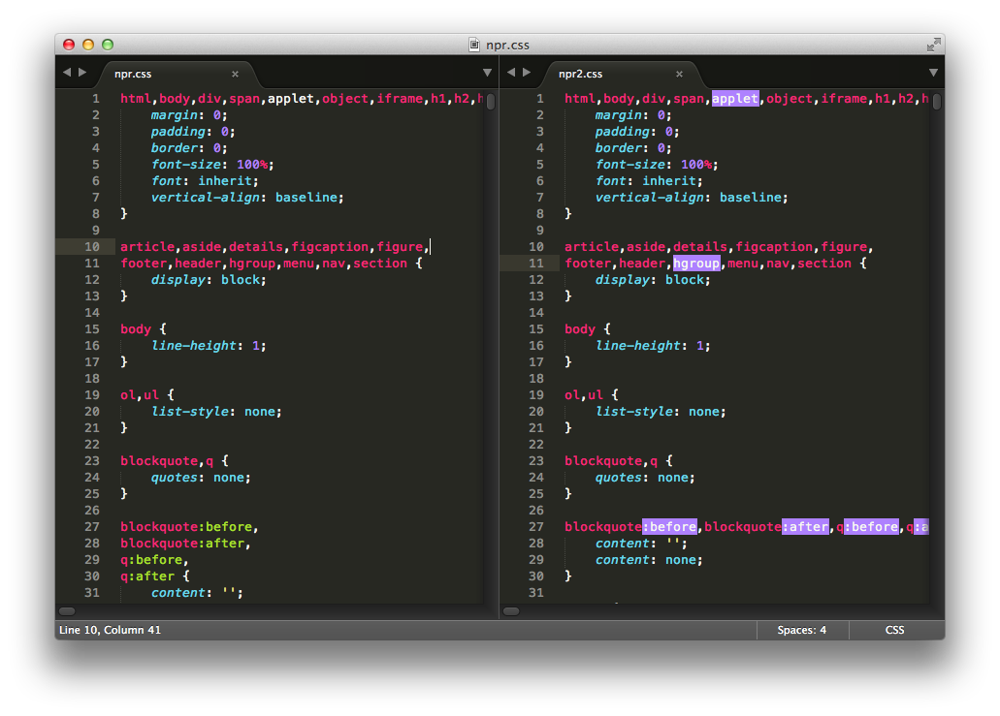
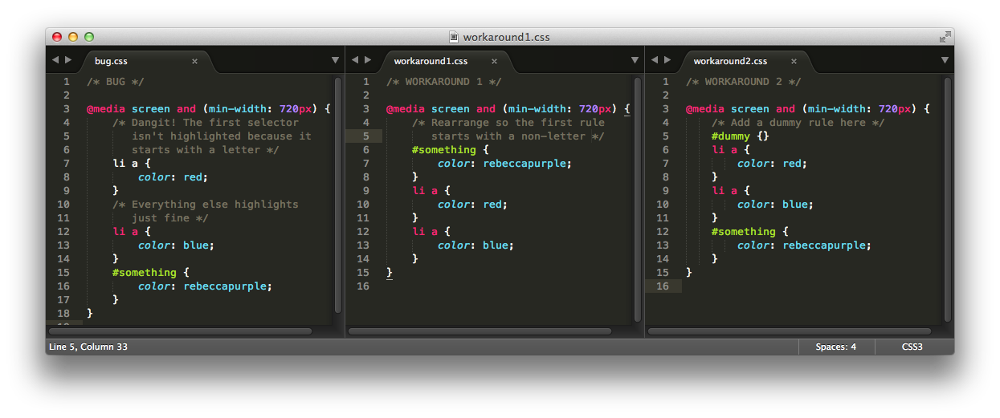

CSS3
====

The most complete CSS support for Sublime Text 3.

## Features

* __Absurdly Complete__: I basically mined the entire set of draft specs
  and supported everything. Some of this stuff won't be implemented in browsers
  for *years*. With a few exceptions, if it's in the spec, it's supported.
* __Productive__: Full set of completions for every property, including many
  prefixed properties.
* __Modern__: Bad, old CSS is flagged. Unnecessarily prefixed properties aren't
  highlighted. Catches lots of mistakes. Also comes with an updated CSS reset
  based on the HTML5 Doctor reset (type `reset` to trigger).
* __Faithful__: Follows the spec extremely closely, with minor deviations that
  encourage a few best practices (see below).

## Before & After

## Installation

This package replaces my previous CSS3_Syntax plugin. This is a billion times
better :)

1. [Install Package Control](https://sublime.wbond.net/installation)
2. Install CSS3

    | Platform | Install Command                                                      |
    | -------- | -------------------------------------------------------------------- |
    | Mac      | `cmd+shift+p`&nbsp;&nbsp; → Package Control: Install Package → CSS3  |
    | Linux    | `ctrl+shift+p` → Package Control: Install Package → CSS3             |
    | Windows  | `ctrl+shift+p` → Package Control: Install Package → CSS3             |

3. (Recommended) Disable the default CSS package

    | Platform | Disable Command                                                      |
    | -------- | -------------------------------------------------------------------- |
    | Mac      | `cmd+shift+p`&nbsp;&nbsp; → Package Control: Disable Package → CSS   |
    | Linux    | `ctrl+shift+p` → Package Control: Disable Package → CSS              |
    | Windows  | `ctrl+shift+p` → Package Control: Disable Package → CSS              |

    

    *Warning: may break other CSS plugins*
4. (Optional) Set CSS3 as the default language for .css files
    * Open a .css file.
    * View → Syntax → Open all with current extension as... → CSS3

    

    *Warning: may break other CSS plugins*

## Best Practices

* [End every property declaration with a semicolon](http://google-styleguide.googlecode.com/svn/trunk/htmlcssguide.xml?showone=Declaration_Stops#Declaration_Stops).
* [Put a space after the colon in a property declaration](http://google-styleguide.googlecode.com/svn/trunk/htmlcssguide.xml?showone=Property_Name_Stops#Property_Name_Stops)

## Known Issues

1. __Within nested code blocks, like inside a @media query, if the first
selector starts with a letter, it will not be highlighted.__

This is an annoying limitation of the Sublime Text syntax highlighting
system. It can't recursively match curly braces across multiple lines. In
this case, the first nested selector is mistaken for a property, which
doesn't match. I went through three or four rewrites before I arrived at the
current design, which is the least fragile and most predictable that I know.
Other CSS highlighters, including my previous CSS3_Syntax and the Default CSS
bundle, have the same problem, but are much easier to break. If this bugs you
like it bugs me, two simple workarounds are shown above.

## Help Me Out!

If you think something's missing, like a prefixed property *that's on the
standards track*, take a minute to open an issue and I'll investigate. I will
monitor the specs as they are updated on [the W3C feed](http://www.w3.org/Style/CSS/current-work.en.html),
but I still need your help. Let's keep bad code out of the Web!
